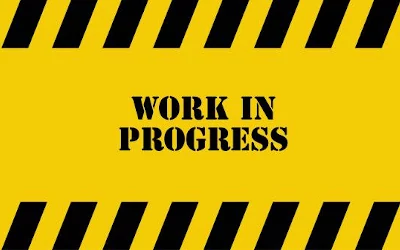

# Backend

Projetos realizados durante o módulo de Backend na escola [trybe](https://www.betrybe.com/).
>Visão geral dos Projetos dividindo cada projeto com seu respetivo repositório, onde é possível acessar todo código.

<table>
  <tr valign="top">
    <td width="50%" align="center">
      <h2>
        Docker Todo-list
      <h2>
      
    </td>
    <td width="50%" align="center">
      <h2>
        All For One
      <h2>
      
    </td>
  </tr>

  <tr valign="top">
    <td width="50%" align="center">
      <h2>
        One For All
      <h2>
      
    </td>
    <td width="50%" align="center">
      <h2>
        Talker Manager
      <h2>
      
    </td>
  </tr>

  <tr valign="top">
    <td width="50%" align="center">
      <h2>
        Store Manager
      <h2>
      
    </td>
    <td width="50%" align="center">
      <h2>
        Blogs API
      <h2>
      
    </td>
  </tr>

  <tr valign="top">
    <td width="50%" align="center">
      <h2>
        Trybesmith
      <h2>
      
    </td>
    <td width="50%" align="center">
      <h2>
        Trybers and Dragons
      <h2>
      
    </td>
  </tr>

  <tr valign="top">
    <td width="50%" align="center">
      <h2>
        TFC - Trybe Futebol Clube
      <h2>
      
    </td>
        <td width="50%" align="center">
      <h2>
        Commerce
      <h2>
      
    </td>
  </tr>

  <tr valign="top">
    <td width="50%" align="center">
      <h2>
        Car Shop
      <h2>
      
    </td>
        <td width="50%" align="center">
      <h2>
        App de Delivery
      <h2>
      
    </td>
  </tr>
</table>