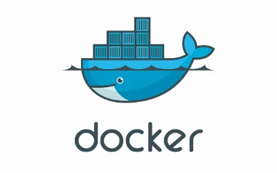
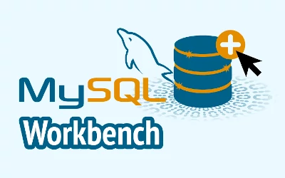
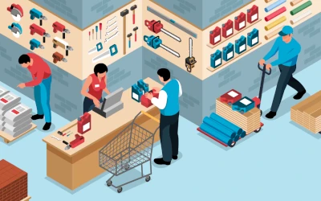
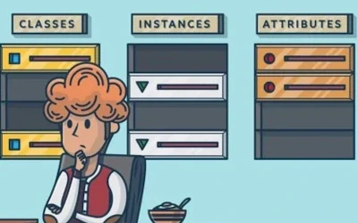
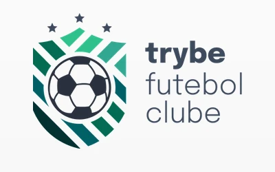

# Backend

Projetos e atividades realizadas durante o módulo de Backend na escola [trybe](https://www.betrybe.com/).
>Visão geral dos Projetos dividindo cada projeto com seu respetivo repositório, onde é possível acessar todo código, alguns blocos não foram necessariamente uma aplicação, principalmente os iniciais, onde tinhamos uma intro há algum conceito ou ferramenta nova, onde era aplica isso em algum projeto produzido pela trybe.

<table>
  <tr valign="top">
    <td width="50%" align="center">
      <h2>
        Docker Todo-list
      <h2>
      
    </td>
    <td width="50%" align="center">
      <h2>
        All For One
      <h2>
      
    </td>
  </tr>

  <tr valign="top">
    <td width="50%" align="center">
      <h2>
        One For All
      <h2>
      
    </td>
    <td width="50%" align="center">
      <h2>
        Talker Manager
      <h2>
      
    </td>
  </tr>

  <tr valign="top">
    <td width="50%" align="center">
      <h2>
        Store Manager
      <h2>
      
    </td>
    <td width="50%" align="center">
      <h2>
        Blogs API
      <h2>
      
    </td>
  </tr>

  <tr valign="top">
    <td width="50%" align="center">
      <h2>
        Trybesmith
      <h2>
      
    </td>
    <td width="50%" align="center">
      <h2>
        Trybers and Dragons
      <h2>
      
    </td>
  </tr>

  <tr valign="top">
    <td width="50%" align="center">
      <h2>
        TFC - Trybe Futebol Clube
      <h2>
      
    </td>
        <td width="50%" align="center">
      <h2>
        Commerce
      <h2>
      
    </td>
  </tr>

  <tr valign="top">
    <td width="50%" align="center">
      <h2>
        Car Shop
      <h2>
      
    </td>
        <td width="50%" align="center">
      <h2>
        App de Delivery
      <h2>
      
    </td>
  </tr>
</table>
